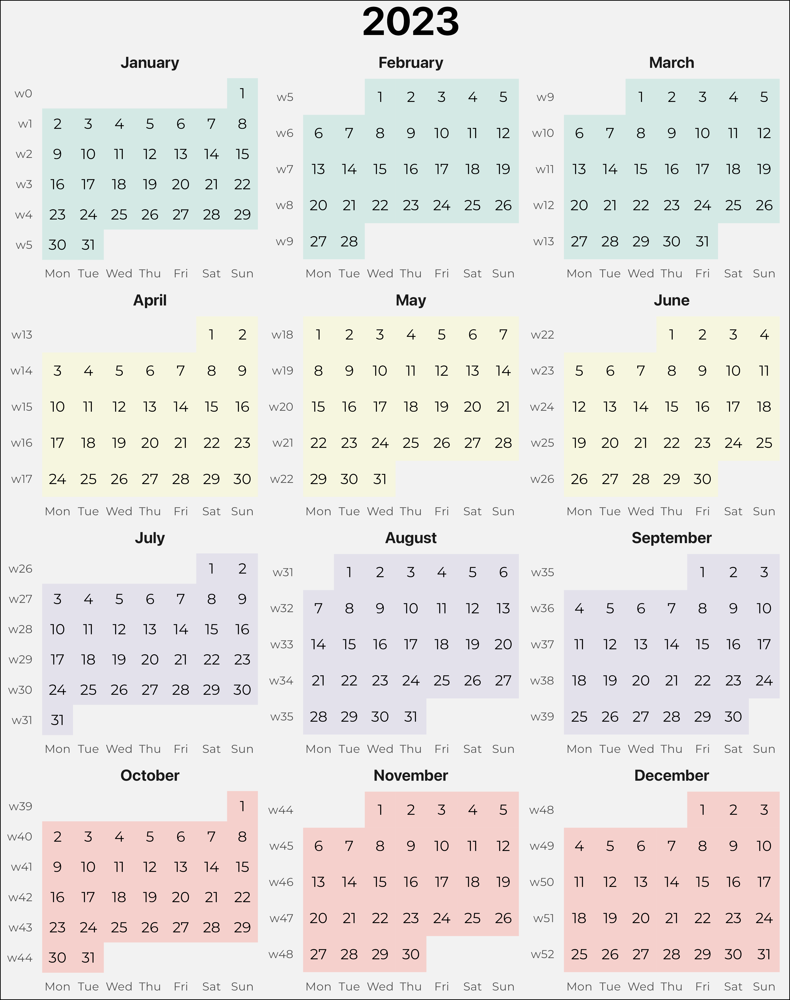

# calendar-ggplot

This is an R script that renders a full-year
calendar using ggplot. The resulting calendar
gets saved as png.

## Usage:

Creates a calendar folder and generates calendars from 2023 to 2030.

```r
./calendar.R {2023..2030}
```

## Sample ('23)

go to [the calendars folder for some already rendered](./calendars)


